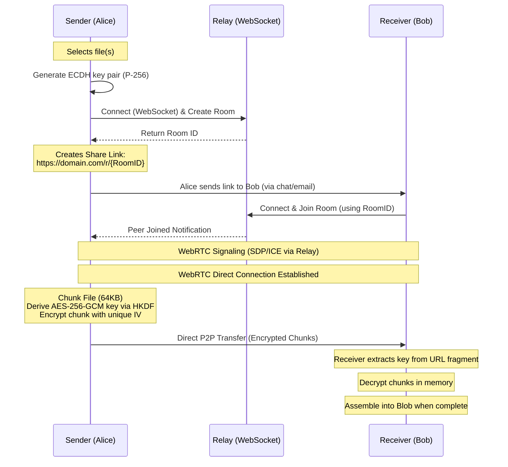

<!--
// Copyright (c) 2024-2026 Soumya Debnath. All Rights Reserved.
// Licensed under the Business Source License 1.1 (BSL 1.1).
// See LICENSE file for details. Production use requires a paid license.
// Contact: soumyadebnath1661@gmail.com | +91 7031648617
-->

<div align="center">
  <h1>PeerVault</h1>
  <p><b>PeerVault sends a file straight from one browser to another with end-to-end encryption, so it never lands on a server you have to pay for or trust.</b></p>

  [](https://mariadb.com/bsl11/)
  []()
  []()
  []()
</div>

<br />

## What is PeerVault?

PeerVault is a browser SDK for serverless, end-to-end encrypted file transfers. It establishes a direct WebRTC DataChannel between sender and receiver browsers. Files are chunked and encrypted using the native Web Crypto API before they leave the sender's device. A lightweight Go relay server handles WebRTC signaling only — it never stores or sees file data.

---

## Table of Contents

1. [Installation](#installation)
2. [Security Architecture](#security-architecture)
3. [Cryptography — What the Code Actually Does](#cryptography--what-the-code-actually-does)
4. [API Reference](#api-reference)
5. [Usage Examples](#usage-examples)
6. [Deployment Guide (Go Relay)](#deployment-guide-go-relay)
7. [Known Limitations](#known-limitations)
8. [Comparison with Competitors](#comparison-with-competitors)
9. [FAQ](#faq)
10. [Author & License](#author--license)

---

## Installation

The SDK package lives in `sdk/`. This library is **not published to npm**.

### Option A — jsDelivr CDN (browser, no build step)

```html
<script type="module">
  import { PeerVaultSender, PeerVaultReceiver } from
    'https://cdn.jsdelivr.net/gh/itsoumya-d/peervault@main/sdk/dist/index.mjs';
</script>
```

### Option B — Clone and build

```bash
git clone https://github.com/itsoumya-d/peervault.git
cd peervault/sdk
npm install
npm run build
# sdk/dist/ is now available locally
```

---

## Security Architecture



### Key Design Points

- **Zero Server Storage:** Files travel directly peer-to-peer. The relay never buffers file data.
- **AES-256-GCM Encryption:** Each 64 KB chunk is encrypted with a unique 12-byte IV. The GCM authentication tag detects tampering.
- **Key in URL Fragment:** The encryption key is embedded in the URL fragment (`#key`). Browsers do not send fragments to servers, so the relay cannot decrypt the data.

---

## Cryptography — What the Code Actually Does

The README previously claimed this SDK implements "ML-KEM (CRYSTALS-Kyber) post-quantum key exchange". **This claim is inaccurate.** Here is what `sdk/src/pq-crypto.ts` actually does:

1. **Key Generation:** `generateECDHKeyPair()` generates a P-256 (ECDH) key pair via `crypto.subtle.generateKey`. This is classical elliptic-curve cryptography, not post-quantum.

2. **ML-KEM attempt:** `generateHybridKeyPair()` attempts `crypto.subtle.generateKey({ name: 'ML-KEM-768' })` inside a `try/catch`. No shipping browser or Node.js version implements ML-KEM in WebCrypto. This always throws; the `mlkem` field is always `undefined`.

3. **Key exchange:** `hybridKeyExchange()` calls `crypto.subtle.deriveBits({ name: 'ECDH', ... })`. This is standard ECDH — not ML-KEM, not hybrid.

4. **Key derivation:** `deriveSharedKey()` correctly applies HKDF-SHA-256 to the ECDH shared secret to produce an AES-256-GCM key.

**The effective construction is P-256 ECDH + HKDF-SHA-256 + AES-256-GCM.** This is a solid, widely-deployed construction and provides strong confidentiality against current classical attackers. It is not post-quantum and does not resist Shor's algorithm. The "harvest now, decrypt later" threat model cannot be addressed by this SDK in its current form.

---

## API Reference

The SDK package is at `sdk/`. All imports come from `sdk/dist/index.mjs`.

### `PeerVaultSender`

```typescript
const sender = new PeerVaultSender(signalingUrl: string);
```

- `addFiles(files: File[]): void` — queues HTML5 `File` objects for transfer.
- `createShareLink(): Promise<string>` — connects to the relay, creates a room, generates the ECDH key pair, and returns `roomId#keyBase64Url`.
- `cancel(): void` — cancels transfer and closes all connections.

**Events (via `.on()`):**
- `recipient_connected` — receiver joined the room; transfer starts automatically.
- `progress` — yields a `TransferProgress` object.
- `complete` — all files sent.
- `error` — WebRTC or encryption error.

### `PeerVaultReceiver`

```typescript
const receiver = new PeerVaultReceiver(signalingUrl: string, shareLinkData: string);
```

`shareLinkData` is the exact string returned by `createShareLink()`.

- `connect(): Promise<FileMetadata[]>` — joins the room and waits for the sender's metadata payload.
- `download(): Promise<void>` — signals the SDK to begin processing incoming chunks.
- `cancel(): void` — stops the download and closes connections.

**Events:** `progress`, `file_complete` (yields `ReceivedFile`), `complete`, `error`.

### `PQCrypto` (static class)

- `generateECDHKeyPair(): Promise<CryptoKeyPair>` — generates a P-256 ECDH key pair.
- `hybridKeyExchange(localPrivate, remotePublic): Promise<ArrayBuffer>` — ECDH derivation (256 bits).
- `deriveSharedKey(sharedSecret, salt?, contextInfo?): Promise<CryptoKey>` — HKDF-SHA-256 → AES-256-GCM.
- `exportPublicKey(key): Promise<string>` — base64url-encodes the raw public key.
- `importPublicKey(base64url): Promise<CryptoKey>` — parses a base64url-encoded P-256 public key.
- `isMLKEMSupported(): boolean` — checks for `crypto.subtle`; does **not** confirm ML-KEM availability (no platform implements it).
- `generateHybridKeyPair(): Promise<{ ecdh: CryptoKeyPair; mlkem?: CryptoKeyPair }>` — always returns `{ ecdh: ..., mlkem: undefined }` on all current platforms.

### Type Definitions

```typescript
interface FileMetadata {
  name: string; size: number; mime: string; chunks: number;
}
interface ReceivedFile extends FileMetadata {
  blob: Blob; url: string;
}
interface TransferProgress {
  fileIndex: number; chunkIndex: number; totalChunks: number;
  bytesTransferred: number; totalBytes: number;
}
```

---

## Usage Examples

### Sending Files

```typescript
import { PeerVaultSender } from
  'https://cdn.jsdelivr.net/gh/itsoumya-d/peervault@main/sdk/dist/index.mjs';

const sender = new PeerVaultSender('wss://relay.yourdomain.com/ws');
sender.addFiles(Array.from(document.getElementById('file-upload').files));

const shareLinkData = await sender.createShareLink();
const fullUrl = `https://yourdomain.com/download#${shareLinkData}`;
console.log('Share this URL:', fullUrl);

sender.on('progress', (p) => {
  console.log(`${((p.bytesTransferred / p.totalBytes) * 100).toFixed(1)}%`);
});
sender.on('complete', () => console.log('Transfer complete'));
```

### Receiving Files

```typescript
import { PeerVaultReceiver } from
  'https://cdn.jsdelivr.net/gh/itsoumya-d/peervault@main/sdk/dist/index.mjs';

const hash = window.location.hash.substring(1);
const receiver = new PeerVaultReceiver('wss://relay.yourdomain.com/ws', hash);

const filesMetadata = await receiver.connect();
console.log('Incoming:', filesMetadata);

receiver.on('file_complete', (file) => {
  const a = document.createElement('a');
  a.href = file.url; a.download = file.name;
  document.body.appendChild(a); a.click();
  document.body.removeChild(a);
  URL.revokeObjectURL(file.url);
});

await receiver.download();
```

---

## Deployment Guide (Go Relay)

The relay is a stateless Go server. It routes SDP/ICE signaling only.

```bash
cd relay
go mod tidy
go run .
# Server starts on port 4002
```

### Environment Variables
- `PORT` (default: `4002`)

### Production (Docker)

```dockerfile
FROM golang:1.20-alpine AS builder
WORKDIR /app
COPY go.* ./
RUN go mod download
COPY . .
RUN go build -o peervault-relay

FROM alpine:latest
WORKDIR /app
COPY --from=builder /app/peervault-relay .
EXPOSE 4002
CMD ["./peervault-relay"]
```

WebRTC requires a secure context (`wss://`). Deploy the relay behind an SSL-terminating proxy.

---

## Known Limitations

- **Pre-release status.** Not on npm. No production adopters. API may change.
- **Post-quantum cryptography is not implemented.** The ML-KEM code path silently falls back to P-256 ECDH on every current platform. The effective construction is ECDH + HKDF + AES-256-GCM (classical, not post-quantum).
- **No TURN relay — connections fail behind symmetric or carrier-grade NAT.** The ICE configuration uses three public STUN servers (`stun.l.google.com:19302` x2, `stun.cloudflare.com:3478`). No TURN server is configured. When ICE negotiation fails, the peer-connection `error` event fires but the error message does not distinguish NAT failure from other WebRTC errors. If you need reliable connectivity across all networks, configure a TURN server in the `PeerConnection` constructor.
- **Files are assembled in RAM.** The receiver reconstructs the file in a JavaScript `Blob`. This limits practical transfer size to available device memory.
- **1:1 sessions.** The relay supports one sender and one receiver per room.
- **Browser environment required** for full operation. `PeerVaultSender` and `PeerVaultReceiver` require `RTCPeerConnection` and `WebSocket`. `PQCrypto` static methods work in Node 24 (has `crypto.subtle`).

---

## Comparison with Competitors

| Feature | PeerVault | WeTransfer | Dropbox | Firefox Send |
| :--- | :--- | :--- | :--- | :--- |
| **E2E Encryption** | Yes (AES-256-GCM) | No | No | Yes |
| **P2P Transfer** | Yes (WebRTC) | No | No | Partial |
| **Server Storage** | Zero | Yes | Yes | Yes |
| **Bandwidth Cost** | Free | Paid Tiers | Paid Tiers | Paid |
| **Post-Quantum** | No (falls back to ECDH) | No | No | No |

---

## FAQ

**Q: Can I transfer folders?**
PeerVault transfers flat arrays of files. Zip folder contents before passing to `addFiles()`.

**Q: What if the browser tab is closed?**
The transfer fails. Both peers must stay connected for the duration.

**Q: Is there a file size limit?**
Limited by receiver RAM. Multi-GB transfers work on desktops with sufficient memory.

---

## License

Licensed under the Business Source License 1.1. See [LICENSE](LICENSE) for details.

For commercial usage, see [COMMERCIAL_LICENSE.md](COMMERCIAL_LICENSE.md).

---

## License — Business Source License 1.1

> **Source-available, NOT open-source. All production use requires a paid license.**

| Tier | Price | For |
|:-----|:------|:----|
| **Indie** | $199/year | Solo developer, <$100K revenue |
| **Startup** | $1,499/year | Up to 10-25 devs, <$5M revenue |
| **Enterprise** | $7,999/year | Unlimited seats, unlimited revenue |
| **OEM / White-Label** | $14,999/year | Embed in your product |
| **Full IP Buyout** | $500,000 | Complete ownership transfer |

**Free use limited to:** Personal evaluation, academic research, contributing via PRs.

[soumyadebnath1661@gmail.com](mailto:soumyadebnath1661@gmail.com) · [github.com/itsoumya-d](https://github.com/itsoumya-d)

© 2024-2026 Soumya Debnath. All Rights Reserved.
