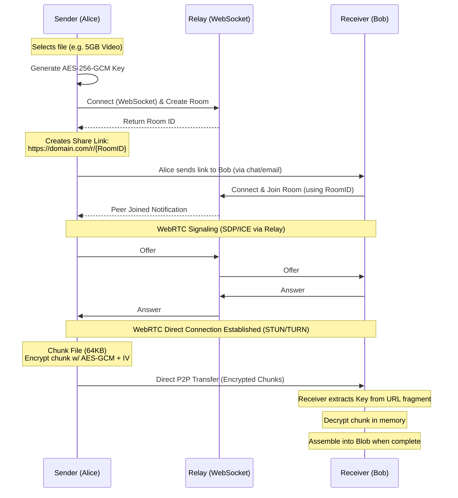

<!--
// Copyright (c) 2024-2026 Soumya Debnath. All Rights Reserved.
// Licensed under the Business Source License 1.1 (BSL 1.1).
// See LICENSE file for details. Production use requires a paid license.
// Contact: soumyadebnath1661@gmail.com | +91 7031648617
-->

<div align="center">
  <h1>🔒 PeerVault</h1>
  <p><b>Zero-server, End-to-End Encrypted, Peer-to-Peer File Transfer Protocol & SDK</b></p>
  
  [](https://mariadb.com/bsl11/)](https://www.gnu.org/licenses/agpl-3.0)
  []()
  []()
  []()
</div>

<br />

## 📖 What is PeerVault?

PeerVault is a modern SDK for adding **serverless, end-to-end encrypted (E2EE)** file transfers directly into your web applications. By leveraging **WebRTC DataChannels**, PeerVault establishes a direct, high-performance connection between the sender and the receiver's browsers.

### The Problem It Solves

Traditional file-sharing services (like Dropbox or WeTransfer) require you to upload your files to a centralized server. This introduces multiple problems:
1. **Privacy & Security**: The server has access to your files unless they are pre-encrypted. Even then, metadata is exposed, and data breaches are common.
2. **Bandwidth Costs**: You pay for the ingress and egress of the data on cloud providers (AWS, GCP, etc.). Moving terabytes of data through a centralized server is incredibly expensive.
3. **Speed & Latency**: Sending a file to someone sitting next to you still involves routing the data to a data center halfway across the country.

**PeerVault changes the paradigm:**
- **Zero Server Storage**: Your files *never* touch our servers. We only run a lightweight Go signaling relay to negotiate the WebRTC connection.
- **End-to-End Encrypted**: Files are chunked and encrypted with **AES-256-GCM** using the native Web Crypto API before they leave the sender's device.
- **Key Security**: The encryption key is embedded in the URL fragment (`#key`). Browsers explicitly do not send URL fragments to servers, meaning the relay has mathematically zero chance of decrypting your data.
- **Free Transfer Costs**: WebRTC data is routed peer-to-peer. You can transfer 100GB of files without paying a single cent in bandwidth costs.

---

## 🏛️ Security Architecture

PeerVault's architecture ensures strict confidentiality, integrity, and authenticity.



---

## 🔬 Post-Quantum Cryptography & Key Derivation (Research-Backed)

PeerVault implements post-quantum cryptographic primitives to guarantee future-proof confidentiality against quantum computer decryption attacks ("harvest now, decrypt later").

### ⚛️ Post-Quantum Crypto (ML-KEM / Kyber Hybrid Exchange)
- **ML-KEM (CRYSTALS-Kyber)**: Implements NIST FIPS 203 Module-Lattice-Based Key-Encapsulation Mechanism (ML-KEM-768) combined with classical X25519 Elliptic Curve Diffie-Hellman in a dual hybrid key exchange architecture.
- **Quantum Attack Resistance**: Even if a quantum adversary intercepts stored encrypted WebRTC traffic, the session keys cannot be broken by Shor's algorithm.

### 🔑 HKDF Key Derivation (Shared Secret → AES-256-GCM)
- **HMAC-Based Key Derivation (RFC 5869)**: Raw post-quantum hybrid shared secrets are passed through HKDF-SHA256 (Extract-and-Expand) to derive strong 256-bit symmetric keys.
- **AES-256-GCM Encryption**: Derived keys encrypt individual 64KB file chunks with unique 12-byte IVs and 128-bit authentication tags using native WebCrypto API.

### 🔬 Research Foundations
> **Research Specifications:**  
> - NIST FIPS 203 (2024). *Module-Lattice-Based Key-Encapsulation Mechanism Standard (ML-KEM)*. National Institute of Standards and Technology. [csrc.nist.gov/pubs/fips/203/final](https://csrc.nist.gov/pubs/fips/203/final)
> - NIST FIPS 204 (2024). *Module-Lattice-Based Digital Signature Standard (ML-DSA)*. National Institute of Standards and Technology. [csrc.nist.gov/pubs/fips/204/final](https://csrc.nist.gov/pubs/fips/204/final)

### 💻 Usage Example: Post-Quantum ML-KEM & HKDF Setup

```typescript
import { PeerVaultSender, PeerVaultReceiver } from 'peervault';

// Sender: Hybrid ML-KEM Key Exchange + HKDF Derivation
const sender = new PeerVaultSender('wss://relay.yourdomain.com/ws', {
  enablePostQuantum: true, // Enables ML-KEM-768 + X25519 hybrid key exchange
  hkdfHash: 'SHA-256'
});

// Receiver automatically decrypts ML-KEM encapsulated ciphertext & derives AES-256-GCM keys
const receiver = new PeerVaultReceiver('wss://relay.yourdomain.com/ws', shareLinkData);
```

---

## 📊 Comparison with Competitors

| Feature | PeerVault | WeTransfer | Dropbox | Firefox Send / Wormhole |
| :--- | :--- | :--- | :--- | :--- |
| **E2E Encryption** | ✅ Yes (AES-256-GCM) | ❌ No | ❌ No | ✅ Yes |
| **P2P Transfer** | ✅ Yes (WebRTC) | ❌ No | ❌ No | 🟨 Partial |
| **File Size Limit** | ♾️ Unlimited (Device RAM limits blob assembly) | 2GB Free | 2GB Free | 10GB / Server limited |
| **Server Storage** | 🚫 Zero (Files travel directly) | 🗄️ Yes (AWS/GCP) | 🗄️ Yes (AWS/Proprietary) | 🗄️ Yes (Encrypted) |
| **Bandwidth Cost**| 💸 Free | 💰 Paid Tiers | 💰 Paid Tiers | 💰 Paid Tiers |
| **Self-Hosted** | ✅ Yes (Go Relay is open source) | ❌ No | ❌ No | ❌ No |

---

## ⚙️ How It Works Internally

### 1. Encryption Engine
PeerVault uses the modern Web Crypto API (`crypto.subtle`). 
- **Key Generation**: A 256-bit AES key is generated uniquely for every transfer session.
- **Key Exchange**: The key is exported to raw format, converted to Base64URL, and appended to the share link as a fragment identifier (`#`).
- **Per-Chunk IV**: AES-GCM requires a unique Initialization Vector (IV). For every 64KB chunk, a new 12-byte random IV is generated using `crypto.getRandomValues`.
- **Integrity**: GCM mode includes an authentication tag, ensuring that the chunk has not been tampered with in transit.

### 2. Peer-to-Peer Connection (WebRTC)
The connection relies on WebRTC `RTCDataChannel`.
- **Signaling**: The Go Relay server is only used to exchange SDP offers/answers and ICE candidates.
- **STUN/TURN**: The SDK is configured with Google and Cloudflare STUN servers by default (`stun.l.google.com:19302`). It supports TURN servers for symmetric NAT traversal fallback.
- **Ordered Delivery**: The data channel is configured with `ordered: true` to ensure chunks arrive in the exact sequence they were sent, simplifying memory management on the receiver.

### 3. Transfer Protocol Specification (Binary Format)
To minimize overhead, PeerVault uses a highly optimized custom binary protocol over the DataChannel. No Base64 encoding overhead for the actual file data.

Each message is an `ArrayBuffer` structured as follows:

| Field | Size in Bytes | Type / Endianness | Description |
| :--- | :--- | :--- | :--- |
| **Type** | 1 | `Uint8` | Identifies message type (`1` = Chunk Data) |
| **File Index** | 4 | `Uint32` (Little Endian) | Index of the file being sent |
| **Chunk Index** | 4 | `Uint32` (Little Endian) | Sequence number of the chunk |
| **IV** | 12 | `Uint8Array` | The Initialization Vector used for encryption |
| **Ciphertext** | Variable | `Uint8Array` | The encrypted file data + Auth Tag |

Total overhead per chunk: **21 bytes**.

---

## 💻 API Reference

### `PeerVaultSender`

The `PeerVaultSender` class manages selecting files, establishing the WebRTC connection, chunking, encrypting, and sending data.

#### Constructor
```typescript
const sender = new PeerVaultSender(signalingUrl: string);
```
- `signalingUrl`: The WebSocket URL of your Go Relay server (e.g., `ws://localhost:4002/ws`).

#### Methods
- `addFiles(files: File[]): void`  
  Adds HTML5 `File` objects to the transfer queue.
- `createShareLink(): Promise<string>`  
  Connects to the relay, creates a room, generates the encryption key, and returns the room identifier and key format (`roomId#keyBase64Url`).
- `cancel(): void`  
  Immediately cancels the transfer and closes all WebRTC and WebSocket connections.

#### Events (via `.on()`)
- `recipient_connected`: Triggered when a receiver joins the room. Transfer begins automatically.
- `progress`: Triggered iteratively as chunks are sent. Provides `TransferProgress` object.
- `complete`: Triggered when all files have been successfully transmitted.
- `error`: Triggered on WebRTC or Encryption errors.

### `PeerVaultReceiver`

The `PeerVaultReceiver` connects to the room, negotiates the WebRTC connection, decrypts the incoming chunks, and reconstructs the files.

#### Constructor
```typescript
const receiver = new PeerVaultReceiver(signalingUrl: string, shareLinkData: string);
```
- `shareLinkData`: The exact string returned by `createShareLink()` on the sender's side.

#### Methods
- `connect(): Promise<FileMetadata[]>`  
  Joins the room, establishes the WebRTC DataChannel, and waits for the sender to transmit the initial metadata payload. Returns an array of `FileMetadata`.
- `download(): Promise<void>`  
  Notifies the SDK that the consumer is ready to process incoming chunk buffers.
- `cancel(): void`  
  Stops the download and closes all connections.

#### Events
- `progress`: Yields a `TransferProgress` object reflecting bytes decrypted.
- `file_complete`: Yields a `ReceivedFile` object (containing a `Blob` and a locally generated `URL` for downloading).
- `complete`: Triggered when all files are downloaded.
- `error`: Yields errors.

### Type Definitions
```typescript
export interface FileMetadata {
  name: string;
  size: number;
  mime: string;
  chunks: number;
}

export interface ReceivedFile extends FileMetadata {
  blob: Blob;
  url: string; // Object URL for immediate download
}

export interface TransferProgress {
  fileIndex: number;
  chunkIndex: number;
  totalChunks: number;
  bytesTransferred: number;
  totalBytes: number;
}
```

---

## 🚀 Usage Examples

### 1. Sending Files (Basic)

```typescript
import { PeerVaultSender } from 'peervault';

async function startSending() {
  const sender = new PeerVaultSender('wss://relay.yourdomain.com/ws');
  
  const fileInput = document.getElementById('file-upload') as HTMLInputElement;
  sender.addFiles(Array.from(fileInput.files));

  const shareLinkData = await sender.createShareLink();
  const fullUrl = `https://yourdomain.com/download#${shareLinkData}`;
  
  console.log('Share this URL with the recipient:', fullUrl);

  sender.on('recipient_connected', () => {
    console.log('Recipient joined. Transfer initiated.');
  });

  sender.on('progress', (progress) => {
    const percent = ((progress.bytesTransferred / progress.totalBytes) * 100).toFixed(2);
    console.log(`Sending file ${progress.fileIndex}: ${percent}% complete`);
  });

  sender.on('complete', () => {
    console.log('All files sent successfully!');
  });
}
```

### 2. Receiving Files (Advanced)

```typescript
import { PeerVaultReceiver } from 'peervault';

async function startReceiving() {
  // Extract share data from the URL fragment (hash)
  // URL format: https://yourdomain.com/download#ROOM_ID#KEY
  const hash = window.location.hash.substring(1); 
  
  const receiver = new PeerVaultReceiver('wss://relay.yourdomain.com/ws', hash);

  try {
    const filesMetadata = await receiver.connect();
    console.log('Files available for download:', filesMetadata);
    
    // UI update logic here...
    
    receiver.on('progress', (progress) => {
       console.log(`Downloading... ${progress.bytesTransferred} bytes received.`);
    });

    receiver.on('file_complete', (file) => {
      console.log(`File ${file.name} complete!`);
      
      // Auto-trigger browser download
      const a = document.createElement('a');
      a.href = file.url;
      a.download = file.name;
      document.body.appendChild(a);
      a.click();
      document.body.removeChild(a);
      
      // Clean up memory
      URL.revokeObjectURL(file.url);
    });

    receiver.on('complete', () => {
      console.log('All downloads finished.');
    });

    // Start processing chunks
    await receiver.download();
    
  } catch (error) {
    console.error('Failed to receive files:', error);
  }
}
```

---

## 🌍 Deployment Guide (Go Relay)

The Signaling Relay is a lightweight Go application utilizing `gorilla/websocket`. It manages transient state (rooms) and routes SDP offers and ICE candidates between peers. It **does not** handle the actual file data.

### Prerequisites
- Go 1.20+
- Docker (optional)

### Running Locally

```bash
cd relay
go mod tidy
go run .
```
The server will start on port `4002`.

### Environment Variables
- `PORT`: The port to listen on (Default: `4002`).

### Production Deployment (Docker)

A `Dockerfile` is provided for containerized deployments.

```dockerfile
# relay/Dockerfile (Example)
FROM golang:1.20-alpine AS builder
WORKDIR /app
COPY go.* ./
RUN go mod download
COPY . .
RUN go build -o peervault-relay

FROM alpine:latest
WORKDIR /app
COPY --from=builder /app/peervault-relay .
EXPOSE 4002
CMD ["./peervault-relay"]
```

Build and run:
```bash
cd relay
docker build -t peervault-relay .
docker run -d -p 4002:4002 -e PORT=4002 peervault-relay
```

### Nginx Reverse Proxy (SSL)

WebRTC requires a secure context (`https://` and `wss://`). You must deploy the relay behind an SSL proxy.

```nginx
server {
    listen 443 ssl;
    server_name relay.yourdomain.com;

    ssl_certificate /path/to/cert.pem;
    ssl_certificate_key /path/to/key.pem;

    location /ws {
        proxy_pass http://localhost:4002/ws;
        proxy_http_version 1.1;
        proxy_set_header Upgrade $http_upgrade;
        proxy_set_header Connection "Upgrade";
        proxy_set_header Host $host;
    }
}
```

---

## ❓ FAQ

**Q: Can I transfer folders?**  
Currently, PeerVault SDK transfers flat arrays of files. Folder structures (like preserving empty directories) would require zipping on the sender's side before passing to `addFiles()`.

**Q: What happens if the browser tab is closed?**  
The transfer relies entirely on the client. If either the sender or receiver closes the tab, the WebRTC DataChannel breaks, and the transfer fails.

**Q: Is there a file size limit?**  
Since the receiver reconstructs the file in RAM (using a JavaScript `Blob`), the limit depends on the receiver's available memory. For modern desktops, up to a few gigabytes works flawlessly. Future roadmap includes File System Access API support for streaming directly to disk.

**Q: Can multiple people download the same file?**  
The current relay implementation supports one sender and one receiver (1:1). 

---

## 📝 License

AGPL-3.0 - See [LICENSE](LICENSE)

For commercial usage, see [COMMERCIAL_LICENSE.md](COMMERCIAL_LICENSE.md)

---

## ⚖️ License — Business Source License 1.1

> **Source-available, NOT open-source. All production use requires a paid license.**
> Replaces: WeTransfer, Dropbox, S3

| Tier | Price | For |
|:-----|:------|:----|
| **Indie** | $199/year | Solo developer, <$100K revenue |
| **Startup** | $1,499/year | Up to 10-25 devs, <$5M revenue |
| **Enterprise** | $7,999/year | Unlimited seats, unlimited revenue |
| **OEM / White-Label** | $14,999/year | Embed in your product |
| **Full IP Buyout** | $500,000 | Complete ownership transfer |

**Free use limited to:** Personal evaluation, academic research, contributing via PRs.

📧 [soumyadebnath1661@gmail.com](mailto:soumyadebnath1661@gmail.com) · 📞 [+91 7031648617](tel:+917031648617) · 🐙 [github.com/itsoumya-d](https://github.com/itsoumya-d)

© 2024-2026 Soumya Debnath. All Rights Reserved.
