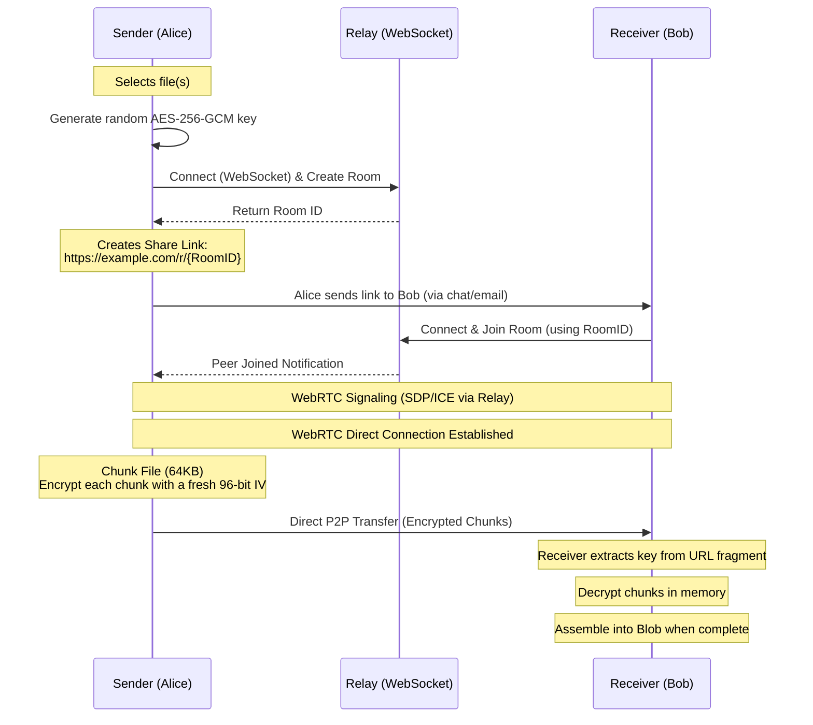

<!--
// Copyright (c) 2024-2026 Soumya Debnath. All Rights Reserved.
// Dual-licensed: AGPL-3.0-or-later (free, see LICENSE) OR a commercial licence
// (see COMMERCIAL_LICENSE.md) if you cannot meet the AGPL's source-disclosure terms.
// Contact: soumyadebnath1619@gmail.com
-->

<div align="center">
  <h1>PeerVault</h1>
  <p><b>PeerVault sends a file straight from one browser to another with end-to-end encryption, so it never lands on a server you have to pay for or trust.</b></p>

  [](https://www.gnu.org/licenses/agpl-3.0)
  []()
  []()
  []()
</div>

<br />

## What is PeerVault?

PeerVault is a browser SDK for serverless, end-to-end encrypted file transfers. It establishes a direct WebRTC DataChannel between sender and receiver browsers. Files are chunked and encrypted using the native Web Crypto API before they leave the sender's device. A lightweight Go relay server handles WebRTC signaling only — it never stores or sees file data.

---

## Table of Contents

1. [Installation](#installation)
2. [Security Architecture](#security-architecture)
3. [Cryptography — What the Code Actually Does](#cryptography--what-the-code-actually-does)
4. [API Reference](#api-reference)
5. [Usage Examples](#usage-examples)
6. [Deployment Guide (Go Relay)](#deployment-guide-go-relay)
7. [Known Limitations](#known-limitations)
8. [Comparison with Competitors](#comparison-with-competitors)
9. [FAQ](#faq)
10. [Author & License](#author--license)

---

## Installation

The SDK package lives in `sdk/`. This library is **not published to npm**.

### Option A — jsDelivr CDN (browser, no build step)

```html
<script type="module">
  import { PeerVaultSender, PeerVaultReceiver } from
    'https://cdn.jsdelivr.net/gh/itsoumya-d/peervault@main/sdk/dist/index.mjs';
</script>
```

### Option B — Clone and build

```bash
git clone https://github.com/itsoumya-d/peervault.git
cd peervault/sdk
npm install
npm run build
# sdk/dist/ is now available locally
```

---

## Security Architecture



### Key Design Points

- **Zero Server Storage:** Files travel directly peer-to-peer. The relay never buffers file data.
- **AES-256-GCM Encryption:** Each 64 KB chunk is encrypted with a unique 12-byte IV. The GCM authentication tag detects tampering.
- **Key in URL Fragment:** The encryption key is a **random 256-bit AES-GCM key** generated by `createShareLink()` and embedded in the URL fragment (`#key`). Browsers do not send fragments to servers, so the relay cannot decrypt the data. Anyone who obtains the full link can decrypt the transfer, so treat the link as the secret.
- **No key agreement runs in the default path.** The ECDH + HKDF code in `PQCrypto` is exported and works, but `PeerVaultSender`/`PeerVaultReceiver` do not call it. Earlier revisions of this README described an ECDH/HKDF handshake that the transfer path does not perform.
- **Chunk indices are not authenticated.** The 21-byte frame header (`type`, `fileIndex`, `chunkIndex`, IV) travels in the clear and is not covered by the GCM tag. The receiver therefore range-checks `chunkIndex`, ignores duplicates, and verifies the assembled byte length against `metadata.size` before returning a file.

---

## Cryptography — What the Code Actually Does

The README previously claimed this SDK implements "ML-KEM (CRYSTALS-Kyber) post-quantum key exchange". **This claim is inaccurate.** Here is what `sdk/src/pq-crypto.ts` actually does:

1. **Key Generation:** `generateECDHKeyPair()` generates a P-256 (ECDH) key pair via `crypto.subtle.generateKey`. This is classical elliptic-curve cryptography, not post-quantum.

2. **ML-KEM attempt:** `generateHybridKeyPair()` attempts `crypto.subtle.generateKey({ name: 'ML-KEM-768' })` inside a `try/catch`. Node 24 **does** implement ML-KEM-768 in WebCrypto (verified: encapsulation key 1184 B, ciphertext 1088 B, shared secret 32 B — the FIPS 203 sizes). The original call requested the `deriveBits` key usage, which is a Diffie-Hellman operation and is rejected for a key-encapsulation mechanism, so it always threw. Even with the usages corrected, **no encapsulation is performed and the ML-KEM shared secret is never mixed into the HKDF input** — the key pair is returned and discarded. There is no lattice arithmetic anywhere in this repository: no NTT, no polynomial arithmetic mod q=3329, no CBD sampling.

3. **Key exchange:** `hybridKeyExchange()` calls `crypto.subtle.deriveBits({ name: 'ECDH', ... })`. This is standard ECDH — not ML-KEM, not hybrid.

4. **Key derivation:** `deriveSharedKey()` correctly applies HKDF-SHA-256 to the ECDH shared secret to produce an AES-256-GCM key.

**The effective construction for an actual file transfer is: a random AES-256-GCM key carried in the share link's URL fragment, with a fresh 96-bit IV per 64 KB chunk and the GCM tag for integrity.** No key agreement is performed. `PQCrypto`'s P-256 ECDH + HKDF-SHA-256 path is a solid, widely-deployed construction and is available if you wire it up yourself, but the share-link flow does not use it.

Either way the protection is classical. It is not post-quantum, does not resist Shor's algorithm, and the "harvest now, decrypt later" threat model cannot be addressed by this SDK in its current form. `PQCrypto.isMLKEMSupported()` is deprecated and returns `false`; `getCapabilities().usesPostQuantumKeyExchange` is always `false`. Use `PQCrypto.probeMLKEM()` if you want a genuine platform feature probe.

---

## API Reference

The SDK package is at `sdk/`. All imports come from `sdk/dist/index.mjs`.

### `PeerVaultSender`

```typescript
const sender = new PeerVaultSender(signalingUrl: string, options?: SenderOptions);

interface SenderOptions {
  iceServers?: RTCIceServer[];   // add a TURN server here; default is STUN-only
  createRoomTimeoutMs?: number;  // default 30000; 0 disables
  stallTimeoutMs?: number;       // default 120000; 0 waits forever
}
```

- `addFiles(files: File[]): void` — queues HTML5 `File` objects for transfer. Throws `TypeError` if not given an array.
- `createShareLink(): Promise<string>` — connects to the relay, creates a room, generates a **random AES-256-GCM key**, and returns `roomId#keyBase64Url`. **Idempotent**: repeat calls resolve with the same link. Rejects if the relay does not acknowledge within `createRoomTimeoutMs`.
- `cancel(): void` — cancels transfer and closes all connections.

**Events (via `.on()`):**
- `recipient_connected` — receiver joined the room; transfer starts automatically.
- `progress` — yields a `TransferProgress` object.
- `complete` — all files sent.
- `error` — WebRTC or encryption error.

### `PeerVaultReceiver`

```typescript
const receiver = new PeerVaultReceiver(
  signalingUrl: string, shareLinkData: string, options?: ReceiverOptions
);

interface ReceiverOptions {
  iceServers?: RTCIceServer[];  // add a TURN server here; default is STUN-only
  connectTimeoutMs?: number;    // default 60000; 0 disables
}
```

`shareLinkData` is the exact string returned by `createShareLink()`.

- `connect(): Promise<FileMetadata[]>` — joins the room and waits for the sender's metadata payload. **Rejects** on relay errors (e.g. `Room not found or full`), on ICE failure, on signaling close, and after `connectTimeoutMs`.
- `download(): Promise<void>` — signals the SDK to begin processing incoming chunks.
- `cancel(): void` — stops the download and closes connections.

**Events:** `progress`, `file_complete` (yields `ReceivedFile`), `complete`, `error`.

### `PQCrypto` (static class)

- `generateECDHKeyPair(): Promise<CryptoKeyPair>` — generates a P-256 ECDH key pair.
- `hybridKeyExchange(localPrivate, remotePublic): Promise<ArrayBuffer>` — ECDH derivation (256 bits).
- `deriveSharedKey(sharedSecret, salt?, contextInfo?): Promise<CryptoKey>` — HKDF-SHA-256 → AES-256-GCM.
- `exportPublicKey(key): Promise<string>` — base64url-encodes the raw public key.
- `importPublicKey(base64url): Promise<CryptoKey>` — parses a base64url-encoded P-256 public key.
- `isMLKEMSupported(): boolean` — **deprecated**, always returns `false`. It previously returned `true` for any environment exposing `crypto.subtle`, which reported post-quantum support that does not exist.
- `probeMLKEM(): Promise<boolean>` — genuine runtime probe using ML-KEM's encapsulate/decapsulate key usages.
- `ecdhKeyExchange(localPrivate, remotePublic): Promise<ArrayBuffer>` — accurately named alias of `hybridKeyExchange`.
- `generateHybridKeyPair(): Promise<{ ecdh: CryptoKeyPair; mlkem?: CryptoKeyPair }>` — the `mlkem` key pair is never used for key agreement.

### Also exported

`CryptoEngine`, `FileChunker`, `FileAssembler`, `CHUNK_SIZE`, `MAX_CHUNKS`, `PeerConnection`, `SignalingClient`, `DEFAULT_ICE_SERVERS`, `EventEmitter`. These were previously internal; they are exported so that TURN servers can be supplied and so the chunking/assembly path is directly testable in Node.

### Type Definitions

```typescript
interface FileMetadata {
  name: string; size: number; mime: string; chunks: number;
}
interface ReceivedFile extends FileMetadata {
  blob: Blob; url: string;
}
interface TransferProgress {
  fileIndex: number; chunkIndex: number; totalChunks: number;
  bytesTransferred: number; totalBytes: number;
}
```

---

## Usage Examples

### Sending Files

```typescript
import { PeerVaultSender } from
  'https://cdn.jsdelivr.net/gh/itsoumya-d/peervault@main/sdk/dist/index.mjs';

const sender = new PeerVaultSender('wss://relay.yourdomain.com/ws');
sender.addFiles(Array.from(document.getElementById('file-upload').files));

const shareLinkData = await sender.createShareLink();
const fullUrl = `https://yourdomain.com/download#${shareLinkData}`;
console.log('Share this URL:', fullUrl);

sender.on('progress', (p) => {
  console.log(`${((p.bytesTransferred / p.totalBytes) * 100).toFixed(1)}%`);
});
sender.on('complete', () => console.log('Transfer complete'));
```

### Receiving Files

```typescript
import { PeerVaultReceiver } from
  'https://cdn.jsdelivr.net/gh/itsoumya-d/peervault@main/sdk/dist/index.mjs';

const hash = window.location.hash.substring(1);
const receiver = new PeerVaultReceiver('wss://relay.yourdomain.com/ws', hash);

const filesMetadata = await receiver.connect();
console.log('Incoming:', filesMetadata);

receiver.on('file_complete', (file) => {
  const a = document.createElement('a');
  a.href = file.url; a.download = file.name;
  document.body.appendChild(a); a.click();
  document.body.removeChild(a);
  URL.revokeObjectURL(file.url);
});

await receiver.download();
```

---

## Deployment Guide (Go Relay)

The relay is a stateless Go server. It routes SDP/ICE signaling only.

```bash
cd relay
go mod tidy
go run .
# Server starts on port 4002
```

### Environment Variables
- `PORT` (default: `4002`)

### Production (Docker)

```dockerfile
FROM golang:1.22-alpine AS builder
WORKDIR /app
COPY go.* ./
RUN go mod download
COPY . .
RUN go build -o peervault-relay

FROM alpine:latest
WORKDIR /app
COPY --from=builder /app/peervault-relay .
EXPOSE 4002
CMD ["./peervault-relay"]
```

WebRTC requires a secure context (`wss://`). Deploy the relay behind an SSL-terminating proxy.

---

## Known Limitations

- **Pre-release status.** Not on npm. No production adopters. API may change.
- **Post-quantum cryptography is not implemented.** The ML-KEM code path silently falls back to P-256 ECDH on every current platform. The effective construction is ECDH + HKDF + AES-256-GCM (classical, not post-quantum).
- **No TURN relay by default — connections fail behind symmetric or carrier-grade NAT.** The default ICE configuration uses three public STUN servers (`stun.l.google.com:19302` x2, `stun.cloudflare.com:3478`) and no TURN server. Pass your own list to fix this:
  ```typescript
  new PeerVaultSender(url, { iceServers: [{ urls: 'turn:turn.example.com:3478', username: 'u', credential: 'p' }] });
  ```
  ICE failure now emits an `error` naming the ICE and connection states, and `connect()` rejects instead of hanging.
- **Transfers are not resumable.** If either tab closes the transfer must restart from the beginning. There is no chunk re-request protocol and no persisted state.
- **Files are assembled in RAM.** The receiver reconstructs the file in a JavaScript `Blob`. Measured peak resident memory is roughly **1.5x the file size** (a 256 MB transfer added ~391 MB RSS under Node 24), so this limits practical transfer size to available device memory. There is no streaming to disk or IndexedDB.
- **1:1 sessions.** The relay supports one sender and one receiver per room.
- **Browser environment required** for full operation. `PeerVaultSender` and `PeerVaultReceiver` require `RTCPeerConnection` and `WebSocket`. `PQCrypto` static methods work in Node 24 (has `crypto.subtle`).

---

## Comparison with Competitors

| Feature | PeerVault | WeTransfer | Dropbox | Firefox Send |
| :--- | :--- | :--- | :--- | :--- |
| **E2E Encryption** | Yes (AES-256-GCM) | No | No | Yes |
| **P2P Transfer** | Yes (WebRTC) | No | No | Partial |
| **Server Storage** | Zero | Yes | Yes | Yes |
| **Bandwidth Cost** | Free | Paid Tiers | Paid Tiers | Paid |
| **Post-Quantum** | **No — not implemented** | No | No | No |
| **Resumable transfers** | No | Yes | Yes | No |
| **Works behind symmetric NAT** | Only with your own TURN | Yes | Yes | Yes |

---

## FAQ

**Q: Can I transfer folders?**
PeerVault transfers flat arrays of files. Zip folder contents before passing to `addFiles()`.

**Q: What if the browser tab is closed?**
The transfer fails. Both peers must stay connected for the duration.

**Q: Is there a file size limit?**
Limited by receiver RAM, at roughly 1.5x the file size in peak memory. `MAX_CHUNKS` caps a declared transfer at 1,000,000 chunks (64 GB). Multi-GB transfers need a desktop with headroom; there is no streaming-to-disk path.

---

## 📄 License

**Dual-licensed — choose either:**

1. **[AGPL-3.0-or-later](LICENSE)** — free for any purpose, including commercial and production
   use. No payment, no permission, no key required. The obligation it carries: if you modify this
   software and let users interact with it over a network, you must offer those users your modified
   source under the same licence.

2. **[Commercial licence](COMMERCIAL_LICENSE.md)** — for organisations that cannot or prefer not to
   meet the AGPL's source-disclosure obligation. This buys an exception, not access.

Contributions are accepted under AGPL-3.0-or-later. Full terms: [LICENSING.md](LICENSING.md).

## ⚖️ Commercial licence (optional)

> **This software is free under [AGPL-3.0-or-later](LICENSE) — including for commercial and
> production use.** The prices below buy one specific thing: an exception to the AGPL's requirement
> that you publish your modifications if you run a modified version as a network service.

| Tier | Price | For |
|:-----|:------|:----|
| **Indie** | $199/year | Solo developer, <$100K revenue |
| **Startup** | $1,499/year | Up to 10-25 devs, <$5M revenue |
| **Enterprise** | $7,999/year | Unlimited seats, unlimited revenue |
| **OEM / White-Label** | $14,999/year | Embed in your product |
| **Full IP Buyout** | $500,000 | Complete ownership transfer |

**Free under AGPL-3.0-or-later:** any use, including production and commercial, provided you meet the AGPL's terms.

[soumyadebnath1619@gmail.com](mailto:soumyadebnath1619@gmail.com) · [github.com/itsoumya-d](https://github.com/itsoumya-d)

© 2024-2026 Soumya Debnath. All Rights Reserved.
